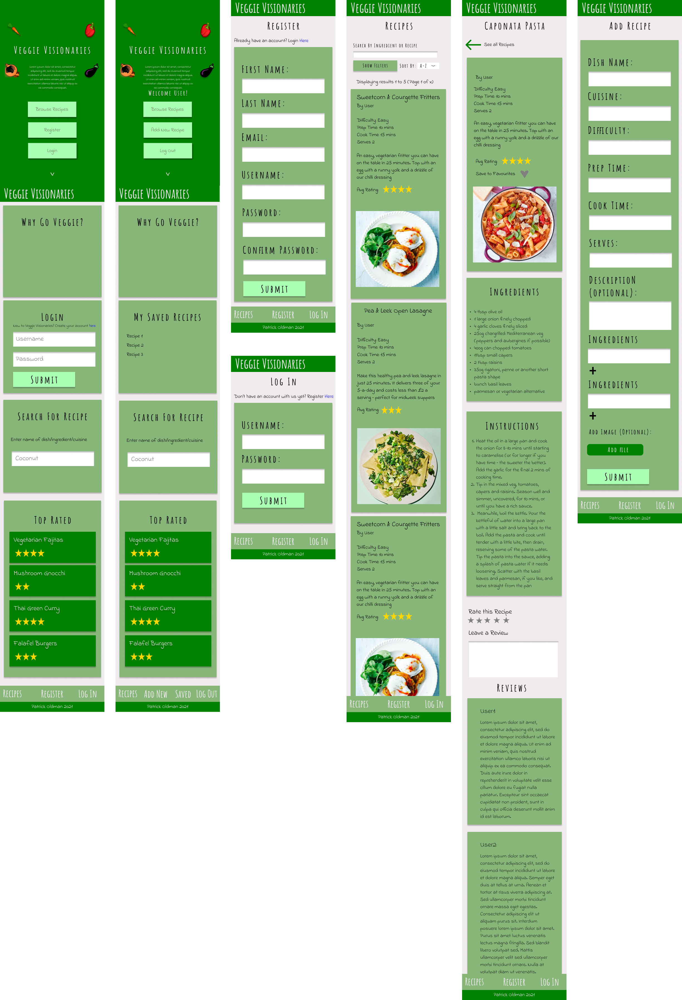
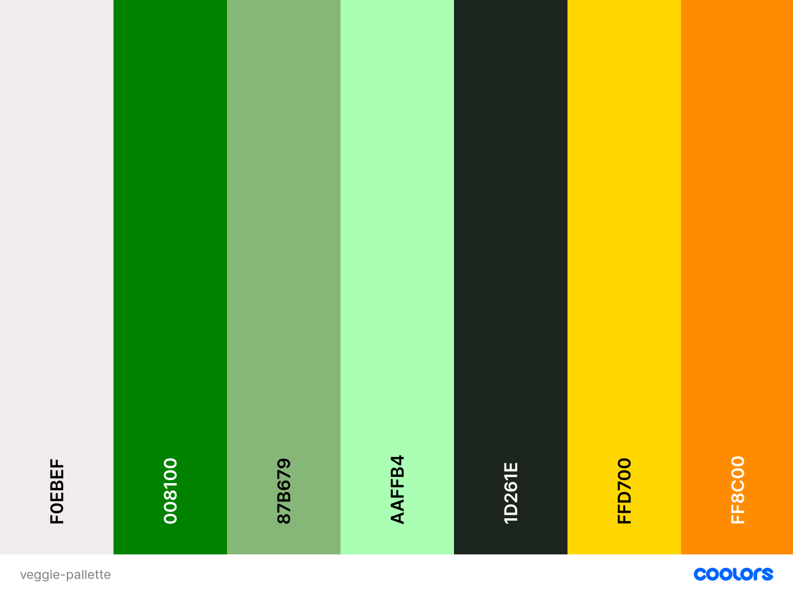

# Veggie Visionaries

## About

This is my third Milestone Project for the Full Stack Software Development Diploma with Code Institute. I will be using HTML, CSS and JavaScript for the front end, developing on the skills I have learned and implemented in my first two projects Happy Dogs Home and Workout Buddy. This project also requires me to implement back end functionality using Python, Flask and MongoDB.

This project is an online cookbook where users can access and share vegetarian recipes. Users will be able to see all recipes stored on the website and search by name/ingredient/cuisine. They can also register an account and log in so they can add their own recipes to the site as well as save existing ones as favourites.

The purpose is also to demonstrate to visitors that a vegetarian diet can be delicious, varied and well balanced. Information to this end is displayed to the user, providing facts and myth busting about a vegetarian diet. Users are encouraged to share their recipes and lifestyle to social media, hopefully encouraging more people to choose this diet.

## UXD

### Strategy

I want to cast as wide a net in terms of user base as possible. The website needs to be informative, visually appealing and easy to use for anyone. The user stories below are therefore relatively non specific, with broad requirements.

#### User Stories

I am a first time visitor and I want:

1. To know what the website is for
2. To be able to quickly access recipes
3. To be able to easily register an account
4. To be able to easily navigate around the site
5. To be able to use the site on all device types

I am a returning visitor/member and I want:

1. To be able to save my favourite recipes to my account
2. To be able to easily access saved recipes
3. To be able to easily add my own recipes
4. To be able to edit and delete my added recipes
5. To be able to see which recipes are highly rated/well reviewed
6. To be able to review recipes

I am the website owner and I want:

1. To encourage first time visitors to return to the site
2. To encourage visitors to consider a vegetarian diet

### Scope

#### Strategy Trade Off Table

Opportunity/Problem | Importance | Viability
--------------------|------------|-----------
Display recipes to users | 5 | 5
Allow users to create account | 5 | 5
Allow logged in users full CRUD functionality in terms of creating, reading, updating and deleting their own recipes | 5 | 5
Create an admin account which has full control over all added recipes | 4 | 5
Add information to encourage users to go Vegetarian | 4 | 4
Allow logged in users to leave a review | 4 | 4
Display nutritional information for each dish | 3 | 2
Hover over ingredients in instructions to get quantity | 3 | 2

The website is built as a Minimum Viable Product, but with room for expansion. I will briefly mention the main features as well as potential 'nice to haves' below.

The core functionality is for a user to be able to log in/log out and be able to Create/Read/Edit/Delete recipes. There is also an admin account which has full control over all recipes, being able to edit and delete anything, while users are only able to edit/delete their own added recipes. A logged in user can leave a review with a rating for any recipe. The average rating from each review is used to calculate the mean average for each recipe. A logged in user can also add any recipe to their 'favourites' which they can view at any time. Recipes are sorted by both difficulty and cuisine. Information is provided on the home page to encourage a user to consider including more vegetarian meals in their diet.

There are a few features which would be nice to have, however are not included at this time. These are things which I would like to return to in future once I have more technical skills under my belt.

Firstly, nutritional information for each recipe would be useful information for any user to see. However, this may be difficult to implement on a site such as this, where users are able to add their own recipes. For example, a user may want to add a recipe for a spaghetti bolognese - while a user ought to know the ingredients/steps involved in preparing this dish, it is unreasonable to expect them to also know the nutritional stats for the meal and to also include this information. Also, as a user, you aren't going to want this extra complication when using the website. A potential solution is to add all 'potential' ingredients to the mongo database as a collection, with each ingredient having nutritional information included. The user could then use a drop down list when creating the recipe to find the ingredients they need, and when the recipe is generated the nutritional information will already be present. A similar feature exists in dietary apps such as myfitnesspal. However for a small scale project like this, it is impractical for me to add nutritional information for potentially hundreds of ingredients so this is unviable at this time. In future I will look into solutios such as perhaps finding an API which stores hundreds of food ingredients nutritional data which may be a quicker way to get the info needed.

Another useful feature would be for the user to be able to hover over ingredients in the instructional steps of a recipe and for a tooltip to appear showing the quantity. For example, if an instructional step for a recipe states 'mix the flour, eggs and milk to create a batter', a user could hover over the word for each ingredient to find out the quantity needed, rather than having to scroll back up to the ingredients section every time. This is difficult to implement, again as the users are adding the recipe data themselves. I wonder if it is practical to add a function which searches through each word in the 'instructions' steps to find a matching ingredient and quantity. In a static website where all the information is added server side, this could be done quite easily and would be a nice feature for a recipe site.

### Structure

Due to the nature of the site, there are several pages that the user can access on the website. Therefore it is very important that navigation is made as easy as possible. There is a navbar at the top of every page, which takes a user to all of the pages they can access. If a user is unable to access a particular page, then a link to that page is not displayed. For example, a user that is not logged in is not provided a link to the 'add recipe' page, as this is a feature that is only usable to logged in users. Equally, a logged in user is not provided with a link to the 'login' page, as they are already logged in. If for whatever reason a user attempts to access a page that they should not have access to through the url, then they are unable to access the primary function of that page. For example, if a non logged in user enters the url for 'add recipe', the page content informs them that they need to be logged in in order to add a recipe, and the links to log in and register are provided. If a logged in user enters the url for the login page, the page content informs them that they are already logged in. A user is never trapped in a place and there is always an option to either return home, or to another section. 

There are several elements included which help a user navigate around the website. As well as the top navbar, on smaller devices I have also included a footer navbar which features icons for links to relevant pages. This is similar to mobile apps like Instagram and Reddit. Having a footer navbar on mobile is better UX as it reduces the amount of clicks needed (as opposed to a hamburger menu), and the bottom of the screen is generally easier to access than the top of the screen for a user. However, the top navbar with hamburger icon is still included. The main index screen differs from the rest of the website, as there is a large hero banner above the navbar with the most important links displayed in the centre of the window. A user can immediately navigate to the most important pages, e.g. login page, or the 'all recipes' page.

Links and other interactive elements are clearly signposted. Button text changes colour upon hover - there is also a colour scheme used where 'add' or 'open' style buttons are coloured green, while 'delete' style buttons are coloured dark orange. Cards that are used as links increase slightly in scale upon hover, as do the top navigation links. Any inline anchor tags within headings or paragraphs are bold within their respective text.

Most visual components included in the site take liberal advantage of the Material Design for Bootstrap library. Not only is this library very useful in terms of responsive design and layout, the components are designed to be visually appealing e.g. the form inputs, cards and accordion as used in this site.

### Skeleton

Below the wireframes created in advance of starting the project. The wireframing software [Figma](figma.com) was used for this as this is easy to use, and gives an excellent approximation of the final appearance of the website.

* Mobile Wireframe
  

* Tablet Wireframe
  

* Desktop Wireframe
  

For the most part, I stuck quite rigidly to these designs to begin with, but as can be seen on the final website, some changes were made. For example, the main hero image is no longer a plain green background with a few svg vegetables included. After receiving user feedback, it was decided that this looked a little boring so this was replaced with a large photograph of vegetables which is much more visually appealing for a user.

### Surface

For the colour scheme I used [Colourmind](http://colormind.io/bootstrap/). This was an excellent tool as the website shows you the appearance of the colour pallette on a mock website.

#F0EBEF light 'off-white' - used as card background colour and for text colour for darker backgrounds
#008100 dark green - used for buttons, card background and navbar
#87B679 light green - main background body colour
#AAFFB4 lighter green - navbar footer to make this stand out
#1D261E dark grey - text colour on dark backgrounds
#FFD700 gold - stars
#FF8C00 dark orange - 'delete' buttons

The only image baked into the website is the main hero image as mentioned in above in the 'Skeleton' section. The image is eye catching and instantly tells the user what the website is for without any text content needed.

Initially, as shown on the wireframes, I had intended to use the fonts 'Amatic SC' for the headings and 'Indie Flower' for the paragraphs. I felt the handwritten style fitted well within the context of a recipe page. However, after user feedback it was decided that it was difficult to read and looked somewhat amateurish. In the end I settled on 'Josefin Sans' for headings and 'Raleway' for the paragraphs as these are both distinctive texts, yet are clean and easy to read.

## Credits

[ohmyveggies.com](https://ohmyveggies.com/reasons-to-become-vegetarian/) for the '7 reasons to become vegetarian' text
[unsplash](https://unsplash.com/photos/4_jhDO54BYg) for hero image of vegetables. Photographer credit: Dan Gold
[Colourmind](http://colormind.io/bootstrap/) used to create the colour scheme. Very useful tool as it shows you what the colour pallette looks like on a mock website
[Coolors](https://coolors.co) used to show pallette
