# Veggie Visionaries

## About

This is my third Milestone Project for the Full Stack Software Development Diploma with Code Institute. I will be using HTML, CSS and JavaScript for the front end, developing the skills I have learned and implemented in my first two projects 'Happy Dogs Home' and 'Workout Buddy'. In addition to the front end languages mentioned above, this also requires me to implement back end functionality using Python, Flask and MongoDB.

This project is an online cookbook where users can access and share vegetarian recipes. Users will be able to see all recipes stored on the website and search by name/ingredient/cuisine. They can also register an account and log in so they can add their recipes to the site as well as save existing ones as favourites.

The purpose is also to demonstrate to visitors that a vegetarian diet can be delicious, varied and well balanced. Information to this end is displayed to the user, providing facts and myth-busting about a vegetarian diet. Users are encouraged to share their recipes and lifestyle on social media, hopefully encouraging more people to choose this diet.

### Mockup

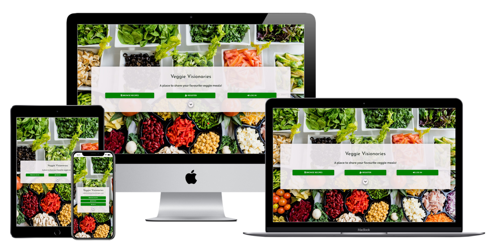

## UXD

### Strategy

I want to cast as wide a net in terms of user base as possible. The website needs to be informative, visually appealing and easy to use for anyone. The user stories below are therefore relatively non-specific, with broad requirements.

#### User Stories

I am a first-time visitor and I want:

1. To know what the website is for
2. To be able to quickly access recipes
3. To be able to easily register an account
4. To be able to easily navigate around the site
5. To be able to use the site on all device types

I am a returning visitor/member and I want:

1. To be able to save my favourite recipes to my account
2. To be able to easily access saved recipes
3. To be able to easily add my recipes
4. To be able to edit and delete my added recipes
5. To be able to see which recipes are highly rated/well-reviewed
6. To be able to review recipes

I am the website owner and I want:

1. To encourage first-time visitors to return to the site
2. To encourage visitors to consider a vegetarian diet
3. To have full administrative control over the site so I can delete/edit recipes as necessary easily

### Scope

#### Strategy Trade Off Table

Opportunity/Problem | Importance | Viability
--------------------|------------|-----------
Display recipes to users | 5 | 5
Allow users to create account | 5 | 5
Allow logged in users full CRUD functionality in terms of creating, reading, updating and deleting their recipes | 5 | 5
Create an admin account that has full control over all added recipes | 4 | 5
Add information to encourage users to go Vegetarian | 4 | 4
Allow logged-in users to leave a review | 4 | 4
Display nutritional information for each dish | 3 | 2
Hover over ingredients in instructions to get quantity | 3 | 2

The website is built as a Minimum Viable Product, but with room for expansion. I will briefly mention the main features as well as potential 'nice to haves' below.

The core functionality is for a user to be able to log in/log out and be able to Create/Read/Edit/Delete recipes. There is also an admin account that has full control over all recipes, being able to edit and delete anything, while users are only able to edit/delete their own added recipes. A logged-in user can leave a review with a rating for any recipe. The average rating from each review is used to calculate the mean average for each recipe. A logged-in user can also add any recipe to their 'favourites' which they can view at any time. Recipes are sorted by both difficulty and cuisine. Information is provided on the home page to encourage a user to consider including more vegetarian meals in their diet.

There are a few features which would be nice to have, however are not included at this time. These are things that I would like to return to in future once I have more technical skills under my belt.

Firstly, nutritional information for each recipe would be useful information for any user to see. However, this may be difficult to implement on a site such as this, where users can add their recipes. For example, a user may want to add a recipe for a spaghetti bolognese - while a user ought to know the ingredients/steps involved in preparing this dish, it is unreasonable to expect them to also know the nutritional stats for the meal and to also include this information. Also, as a user, you aren't going to want this extra complication when using the website. A potential solution is to add all 'potential' ingredients to the mongo database as a collection, with each ingredient having nutritional information included. The user could then use a drop-down list when creating the recipe to find the ingredients they need, and when the recipe is generated the nutritional information will already be present. A similar feature exists in dietary apps such as myfitnesspal. However, for a small scale project like this, it is impractical for me to add nutritional information for potentially hundreds of ingredients so this is unviable at this time. In future, I will look into solutions such as perhaps finding an API that stores hundreds of food ingredients nutritional data which may be a quicker way to get the info needed.

Another useful feature would be for the user to be able to hover over ingredients in the instructional steps of a recipe and for a tooltip to appear showing the quantity. For example, if an instructional step for a recipe states 'mix the flour, eggs and milk to create a batter', a user could hover over the word for each ingredient to find out the quantity needed, rather than having to scroll back up to the ingredients section every time. This is difficult to implement, again as the users are adding the recipe data themselves. I wonder if it is practical to add a function that searches through each word in the 'instructions' steps to find a matching ingredient and quantity. In a static website where all the information is added server-side, this could be done quite easily and would be a nice feature for a recipe site.

### Structure

Due to the nature of the site, there are several pages that the user can access on the website. Therefore navigation must be made as easy as possible. There is a navbar at the top of every page, which takes a user to all of the pages they can access. If a user is unable to access a particular page, then a link to that page is not displayed. For example, a user that is not logged in is not provided with a link to the 'add recipe' page, as this is a feature that is only used for logged-in users. Equally, a logged-in user is not provided with a link to the 'login' page, as they are already logged in. If for whatever reason a user attempts to access a page that they should not have access to through the URL, then they are unable to access the primary function of that page. For example, if a non logged in user enters the URL for 'add recipe', the page content informs them that they need to be logged in to add a recipe, and the links to log in and register are provided. If a logged-in user enters the URL for the login page, the page content informs them that they are already logged in. A user is never trapped in a place and there is always an option to either return home or another section. 

There are several elements included that help a user navigate around the website. As well as the top navbar, on smaller devices, I have also included a footer navbar that features icons for links to relevant pages. This is similar to mobile apps like Instagram and Reddit. Having a footer navbar on mobile is better UX as it reduces the number of clicks needed (as opposed to a hamburger menu), and the bottom of the screen is generally easier to access than the top of the screen for a user. However, the top navbar with the hamburger icon is still included. The main index screen differs from the rest of the website, as there is a large hero banner above the navbar with the most important links displayed in the centre of the window. A user can immediately navigate to the most important pages, e.g. login page, or the 'all recipes' page.

Links and other interactive elements are signposted. Button text changes colour upon hover - there is also a colour scheme used where 'add' or 'open' style buttons are coloured green, while 'delete' style buttons are coloured dark orange. Cards that are used as links increase slightly in scale upon hover, as do the top navigation links. Any inline anchor tags within headings or paragraphs are bold within their respective text.

Most visual components included in the site take liberal advantage of the Material Design for Bootstrap library. Not only is this library very useful in terms of responsive design and layout, but the components are also designed to be visually appealing e.g. the form inputs, cards and accordion as used in this site.

### Skeleton

Below the wireframes created in advance of starting the project. The wireframing software [Figma](figma.com) was used for this as this is easy to use, and gives an excellent approximation of the final appearance of the website.

* Mobile Wireframe
  

* Tablet Wireframe
  

* Desktop Wireframe
  

For the most part, I stuck quite rigidly to these designs, to begin with, but as can be seen on the final website, some changes were made. For example, the main hero image is no longer a plain green background with a few SVG vegetables included. After receiving user feedback, it was decided that this looked a little boring so this was replaced with a large photograph of vegetables which is much more visually appealing for a user.

### Surface

For the colour scheme, I used [Colourmind](http://colormind.io/bootstrap/). This was an excellent tool as the website shows you the appearance of the colour palette on a mock website.

* #F0EBEF light 'off-white' - used as card background colour and for text colour for darker backgrounds
* #008100 dark green - used for buttons, card background and navbar
* #87B679 light green - main background body colour
* #AAFFB4 lighter green - navbar footer to make this stand out
* #1D261E dark grey - text colour on dark backgrounds
* #FFD700 gold - stars
* #FF8C00 dark orange - 'delete' buttons


The only image baked into the website is the main hero image as mentioned above in the 'Skeleton' section. The image is eye-catching and instantly tells the user what the website is for without any text content needed.

Initially, as shown on the wireframes, I had intended to use the fonts 'Amatic SC' for the headings and 'Indie Flower' for the paragraphs. I felt the handwritten style fits well within the context of a recipe page. However, after user feedback, it was decided that it was difficult to read and looked somewhat amateurish. In the end, I settled on 'Josefin Sans' for headings and 'Raleway' for the paragraphs as these are both distinctive texts, yet are clean and easy to read.

## Database Model

For this project, the NoSQL database MongoDB was used. Within the database, for this project, I made four collections. Recipes, users, reviews and cuisines.

### Recipes

This concerns all recipes in the database and includes all details as entered by the user.

Key | Data Type | Info
----|-----------|-------
id | ObjectId | Recipe unique Id. Also used to generate URL for each recipe page
name | String | Recipe name e.g. Spaghetti
cuisine | String | The associated cuisine for each recipe e.g. Italian
difficulty | String | Recipe difficulty e.g. Easy
prep_time | Int32 | Time taken to prepare recipe
cook_time | Int32 | Time is taken to cook recipe
serves | Int32 | Number of people served by recipe
description | String | Description of the recipe limited to 250 char
ingredients | Array | Ingredients for this recipe (limited to 20)
instructions | Array | Instruction steps for this recipe (limited to 10)
image | String | Url for uploaded image for this recipe (not required)
created_by | String | Name of current session user when the recipe is created
date | String | Date when the recipe is created
time | String | Time when the recipe is created
rating | Array | Array of review ratings for this recipe as added by users in the 'Reviews' collection
avgrating | Int32 | Mean average of all review ratings for this recipe

### Users

This concerns all users who have created an account on the website

Key | Data Type | Info
----|-----------|-------
id | ObjectId | User unique id
email | String | User email address
username | String | User username
password | String | Hashed user password
favorite | Array | List of all recipes favorited by the user in dict form

### Reviews

This concerns all reviews of recipes as entered by users

Key | Data Type | Info
----|-----------|-------
id | ObjectId | Review unique id
recipe | String | The unique id of the associated recipe for this review
rating | Int32 | Value of rating (1-5) 
review | String | Text value of review (not required)
date | String | Date when the review is created
time | String | Time when the review is created

### Cuisines

This concerns all cuisines as created by the admin

Key | Data Type | Info
----|-----------|-------
id | ObjectId | Cuisine unique id
name | String | Name of the cuisine e.g. Italian
image | String | Url for uploaded image for this cuisine (not required)

## Features

I will go through the site features by page, displaying possible features for a 'non-logged in' user, a logged-in user and the admin user. For brevity, I will henceforth refer to a 'non-logged in' user as 'loggedout' and a logged-in user as 'loggedin'. All screenshots will be the desktop version of the site as the functionality is the same for all devices.

### Navbar

The navbar content differs depending on whether the user is logged in or logged out.

* Loggedout - Links to home, all recipes, cuisines, to register and to log in.


* Loggedin - Links to home, user favourites, all recipes, to add a recipe, cuisines and to log out. This is the same for the admin account.


### Index Page

Upon opening the main index page, the user is greeted by a large hero image displaying bowls of vegetables with a floating card above the image. The card contains the website name, a small text 'A place to share your favourite veggie meals!' and links to the most important pages on the site. There is also an arrow button below the links, informing the user there is more content below.

* Loggedout - index hero image. Links take the user to browse all recipes, to register or to log in.
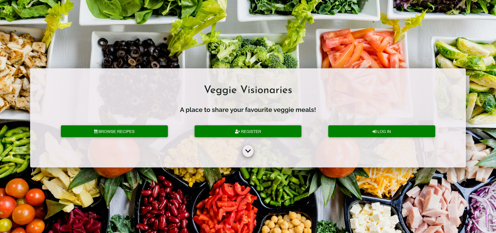

* Loggedin - index hero image. Links take the user to browse all recipes, to add a recipe or to log out. There is also a welcome text for the user. This is the same for the admin account.
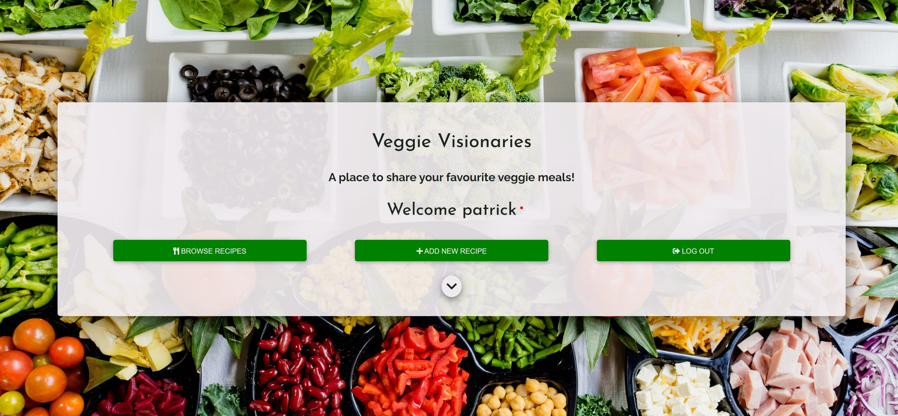

Below the main hero banner, there is further content. For all users, cards display information encouraging a user to 'go veggie', the option to search for a recipe, and a list of the top 5 rated recipes. Loggedout user can log in from here, while loggedin can view their favourited recipes. This is the same for the admin account.

* Loggedout
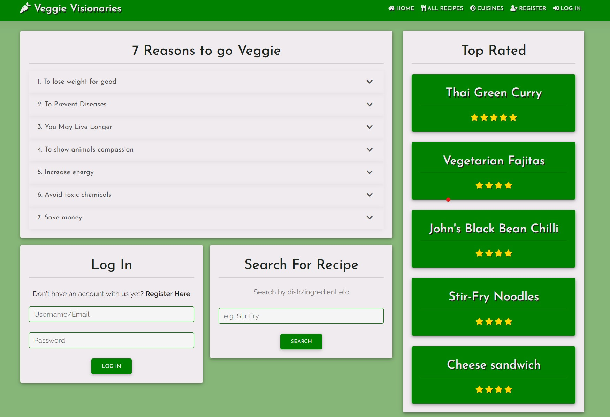

* Loggedin
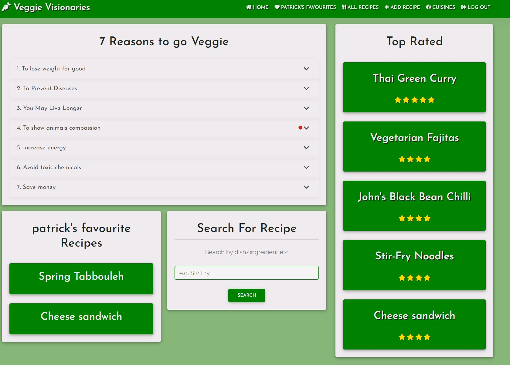

### Recipes Page

This page displays all recipes added to the website. This looks roughly the same for all users, with some small differences if one is logged in, logged out or an admin which I will describe in more detail when necessary. First, I will describe the functions all users can operate.

#### Recipe Filters

The default display of the page is to display all recipes in descending order, with the most recently added recipe first. There are various ways a user can filter or sort the recipes as well as search. The user can also see which (if any) filters are applied.

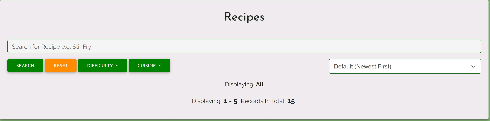

##### Pagination

The page makes use of Flask's pagination module, so only 5 recipes are displayed at a time. The user is shown at the top of the page how many recipes there are in total, as well as which page they are currently on.

##### Search

The user can search through the database for any word contained in a recipe document within the recipe collection. For example, most obviously a user can search for the name of a recipe. They can also search for an ingredient or the name of a recipe creator. The search results are shown on a separate page. From here a user can either view the recipes or return to the main recipes page.

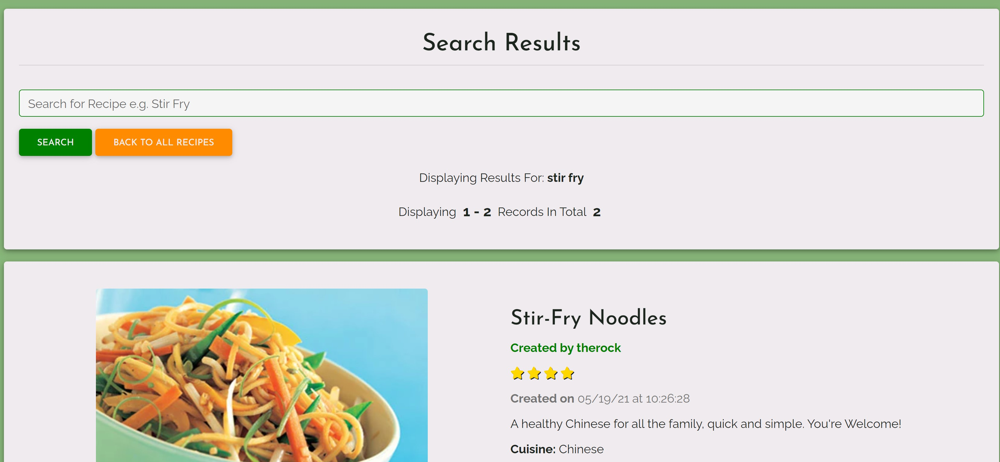

##### Filters

There are two filters a user can use for the recipes. Difficulty and cuisine. The difficulty options are baked into the website as 'easy', 'medium' and 'hard' and the user must choose one of these options when creating a recipe. The cuisines are taken from the database and can be added/deleted by the site admin from the website. These features will be discussed in more detail later. Both filters can be used in conjunction with each other, e.g. a user can filter by Easy/Mexican, Medium/Chinese recipes etc. Alternatively, each filter can be individually reset to display 'all' recipes, e.g. to show Easy/All, All/Chinese etc.

##### Add Recipe

If the user is logged in, there is also a button prompting them to add a new recipe.

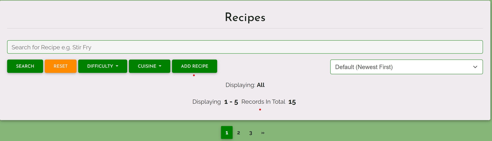

##### Sort

A user can sort the displayed recipes into different orders, I have included 4 options with the default being newest first. The other 3 options are A-Z, Rating (top rated first) and Oldest First. Sorting can be done even when recipes are filtered.

##### Reset

The orange reset button resets the page to display all recipes in the newest order and can be operated at any time.

#### Recipes List

As stated above, by default all recipes are shown in descending order. The most important information for each recipe is displayed alongside an image of the recipe (if applicable). If no image URL is to be found in the database, there is a default blank 'camera' icon which displays instead. If the current session user is the recipe creator or admin, they have the option to edit and delete their recipe from this screen.

* Loggedout - when a user is logged out, only the information is displayed. User can select either 'view recipe' or click on the image to open up more info to the recipe.
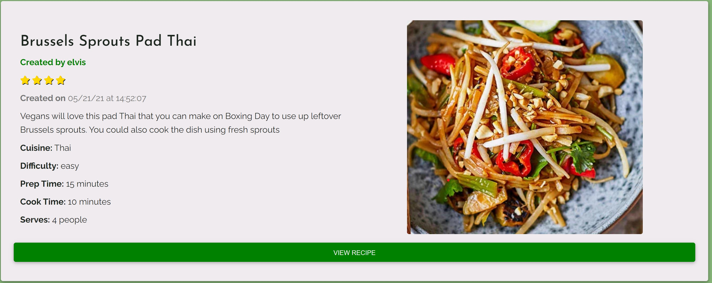

* Logged in - when a user is logged in, their added recipes have the option to edit/delete their recipe as well. As can be seen below, the session user is 'elvis' and can edit/delete this recipe.
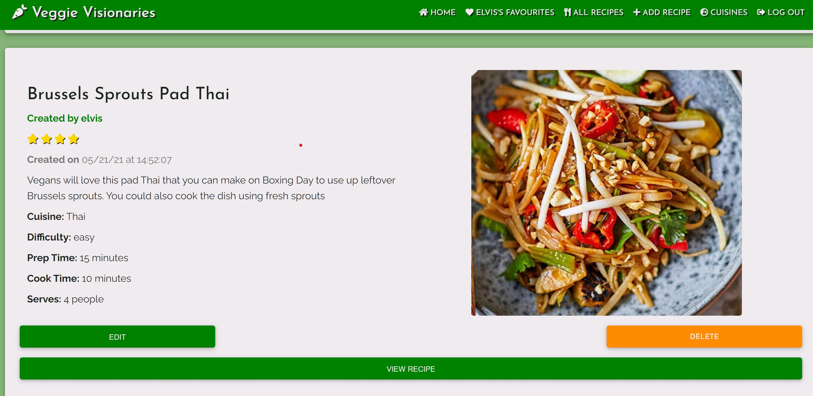
As can be seen below, this recipe was not created by 'elvis', and therefore cannot be edited/deleted by this user.
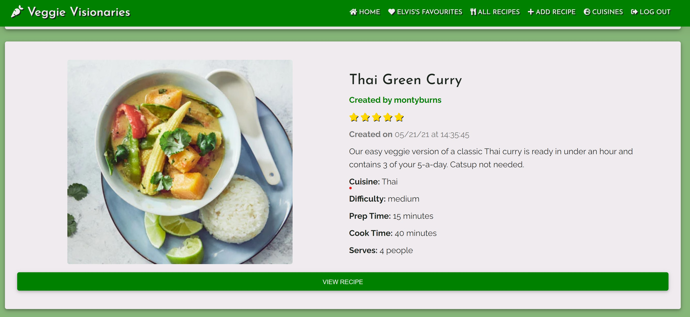
If the logged-in user is 'admin', then full control over edit/delete functions on this page is provided.

### Recipe Page

The page which displays all recipes has several sections.

1. Recipe info - this displays all the same information as displayed on its card on the 'all recipes' page. A logged-in user also has the option to add the recipe to their 'favourites'. More info will be given on this functionality later on.
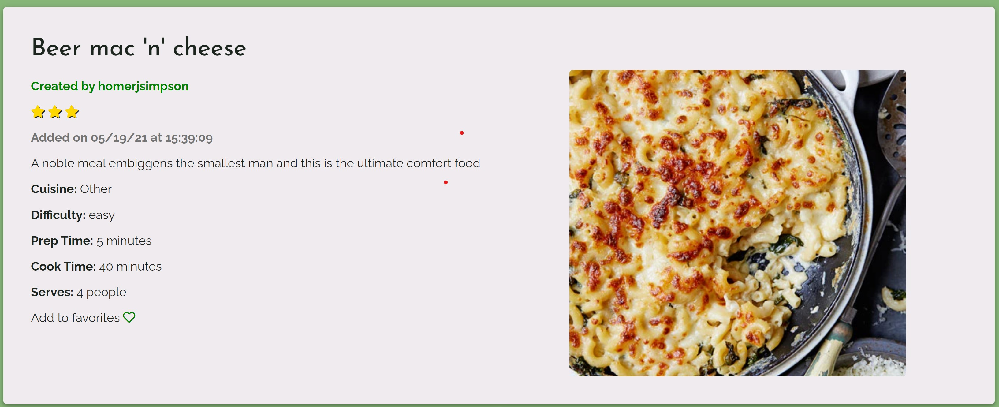

2. A list of ingredients for this recipe in an unordered list format.
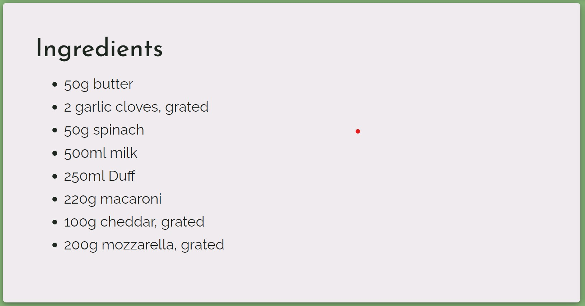

3. A list of instructions for this recipe in an ordered list format.
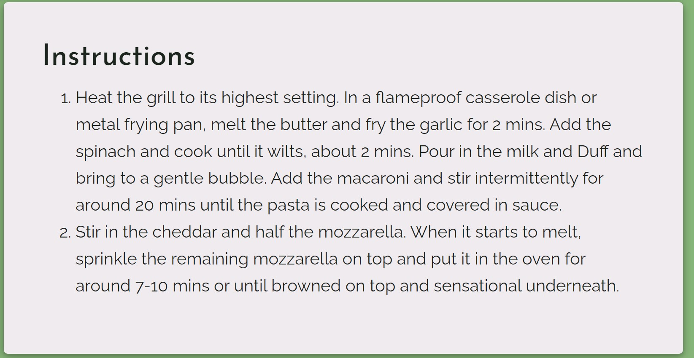

4. Review Form
  - If a user is logged in, an 'add review' form.
    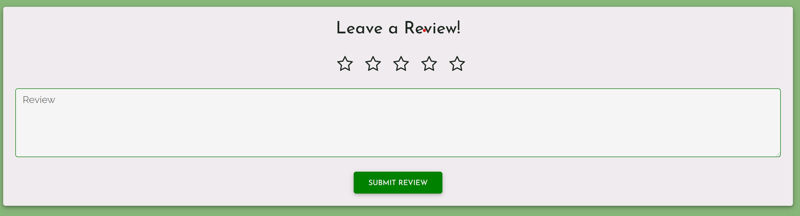
  - If the session user is the recipe creator, they cannot review the recipe as their opinion would presumably be somewhat biased.
    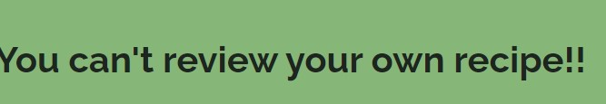
  - If the user is loggedout, this form is not visible and the user is prompted to log in or register to leave a review.
    

5. A list of all reviews for this recipe in order of newest first. Reviewer username, date, time, rating and review text is displayed.
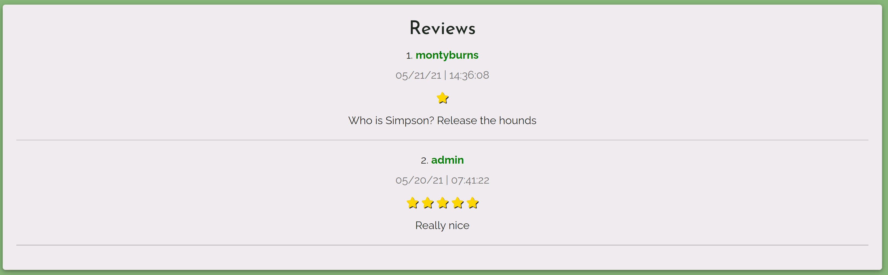

### Favourites

If a user is logged in, they can add and view their favourite recipes. A recipe can be added to favourites as described above, from the recipe page. A user can add their own added recipes to favourites as well, as there is no reason they shouldn't be allowed to like their meals. Upon selecting the favourite 'heart' icon, the user is redirected to their favourites page. The favourites page shows a list of the user's favourites, and from here the user can either access the recipe's page or remove the recipe from their favourites.
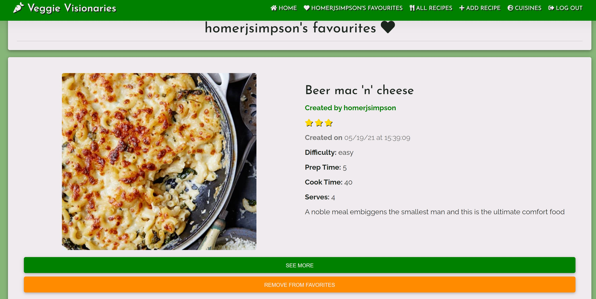
A recipe can also be removed from the user's favourites from the recipe page by selecting the same 'heart' icon on a favourited recipe.

### Cuisines

Recipes are sorted by cuisine. Site users can visit the 'cuisines' page which lists all cuisines that have been added. These are shown in list format on cards, which display the cuisine name and an appropriate image. Only the site admin has the power to add/delete cuisines.
  - If the current user is not admin - same for loggedin and loggedout
    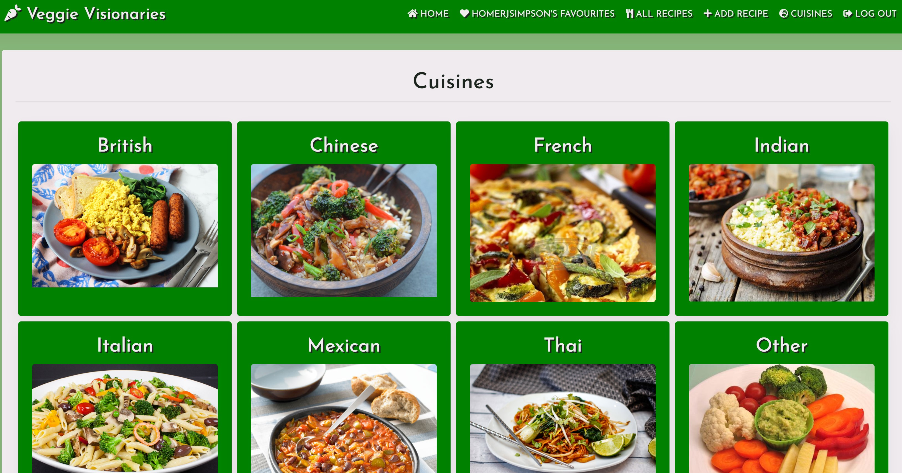
  - If the current user is admin. From here admin can also add cuisines (name and photo), and delete cuisines.
    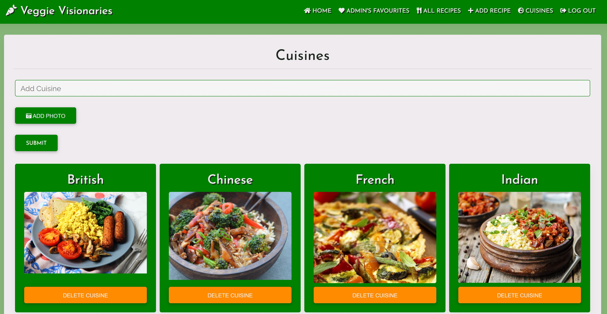
If the admin deletes a cuisine and there are recipes in the database which have this cuisine name as their cuisine, their cuisine is changed to 'other' automatically. For example, if we have the recipe 'Pizza' on the database with the cuisine 'Italian', if the admin deletes the 'Italian' cuisine, 'Pizza's cuisine will be changed to 'other'.

### Add Recipe

Any logged-in user can add a recipe. This is done from the 'add recipe' page. If loggedout attempts to reach this page, they are prompted to log in. The form itself has several fields which update the recipe collection in the database when submitted.

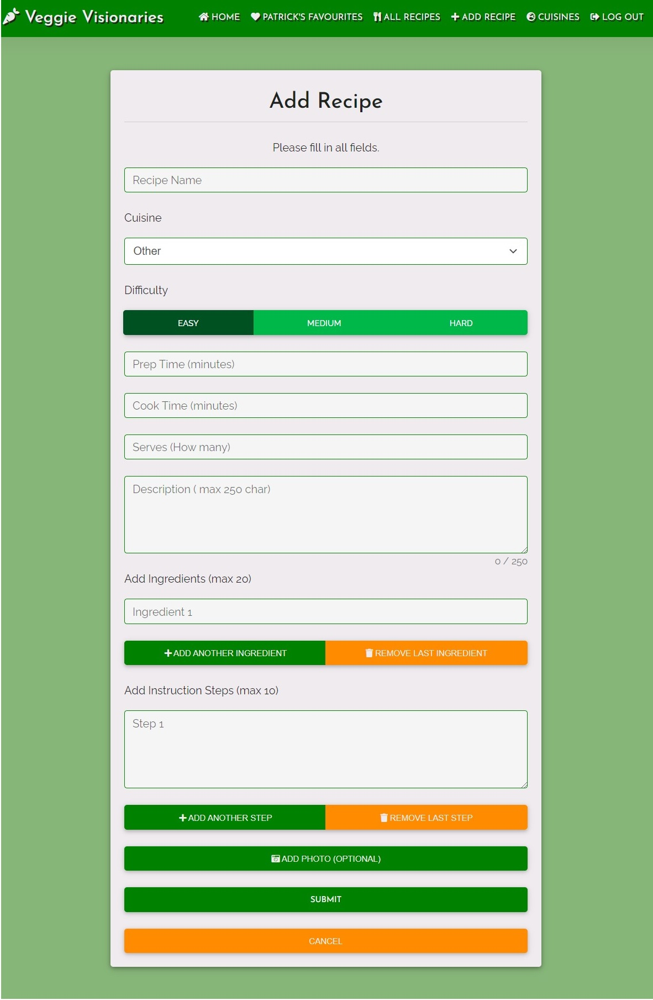

1. Recipe Name - adds recipe name
2. Cuisine - a select menu, which takes all cuisines from the cuisines collection. The default option is 'other'
3. Difficulty - user must select recipe difficulty from easy/medium/hard. Easy by default.
4. Prep Time - adds prep time
5. Cook Time - adds cook time
6. Serves - adds people served
7. Description - short description of the recipe max 250 char
8. Ingredients (max 20) - user can add up to 20 ingredients. By default only one input is shown, but it is easy for the user to add further inputs as needed using the 'add another ingredient' button. If the user changes their mind, the last input can be deleted just as easily.
9. Instruction Steps (max 10) - this works in much the same way as the ingredient inputs
10. Add a photo - uses a Cloudinary widget to upload a photo to the Cloudinary storage on my account. Upon upload, Cloudinary generates a unique URL for the image which is passed to a hidden input box on the form. Upon upload, the add photo button is removed from the window to make sure a user cannot add a second image. If an image upload is successful, there is positive feedback on the page.

Finally, the user can submit the form. Alternatively, they can cancel and this redirects the user to the recipes page.

### Edit Recipe

This functions in much the same way as the add recipe page. The appearance is identical, the only difference being that the recipe data is passed into the form by default.

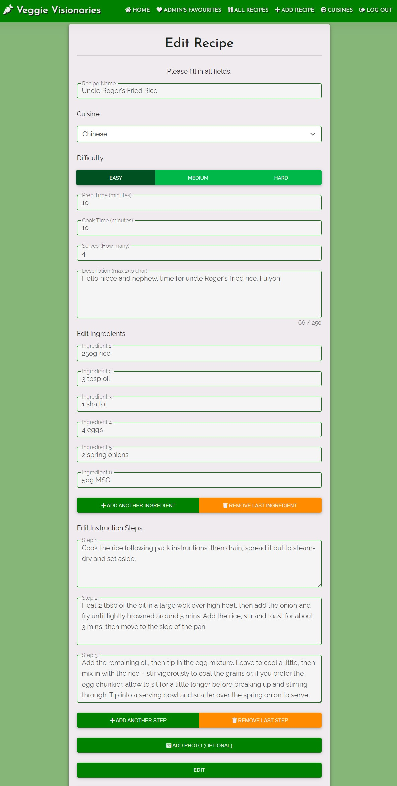

### Register

The registration form is simple, asking a user for only their email address, and to create a user name and password. The password must be entered twice to confirm. The 'Register' button is inactive by default and is only available once all fields are valid. Textual information is provided upon typing in the box to help the user know when their info is valid. Once the form has been submitted, the data is added to the 'users' collection in the database and the new user is immediately logged in as the current session user. If the username is already taken, then the form submit fails and the username is alerted to this fact by a flash message.

* Empty form
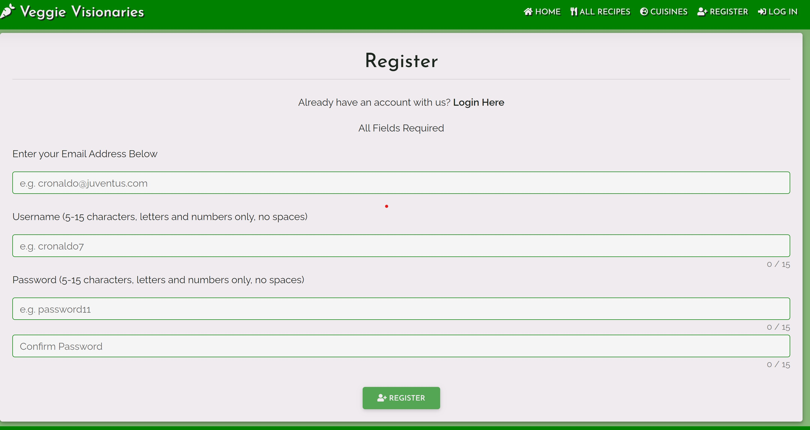

* Validation
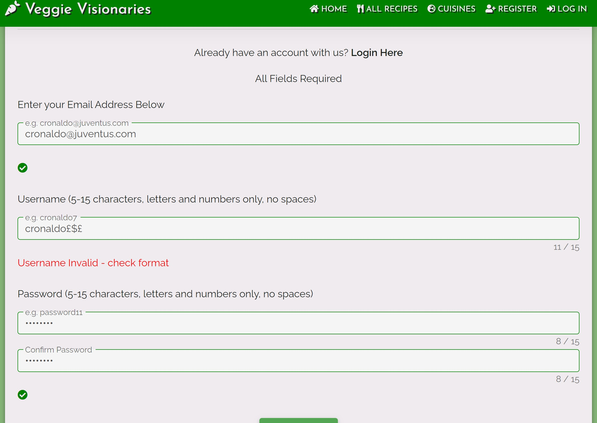

### Log In

The login form is almost identical in appearance to the register screen. There are two inputs, one for username/email and one for the password. It was decided to allow users to log in using either their username or email as we often don't remember our usernames and the email address is a simple alternative that appears to have become a web standard for login forms. Upon successful login, the user is added to the session cookie.

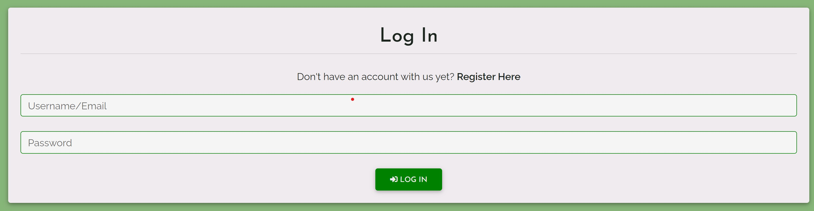

### Potential Future Features

As described in the Scope section of this writeup, there are a few extra features that could be added to the website in future. For example, it may be possible to use an API to pull nutritional information for all food ingredients and add these as options on a searchable ingredients list when a user creates a new recipe. 

It would be nice to have a few more filters to use on the recipe page, perhaps a user could filter by cooking/prep time. If the above method to add nutritional data could be implemented, recipes could be filtered by the nutritional value. Other filters used could be 'contains nuts', 'vegan' etc in case users have more specific dietary requirements.

## Testing

### User Story Testing

I am a first-time visitor and I want:

1. To know what the website is for
  - The app is called 'Veggie Visionaries', the title of which is instantly visible on the homepage and navigation elements.
  - The landing page includes a short text 'A place to share your favourite veggie meals'
  - The landing page has a large hero image featuring various vegetables and dishes
  

2. To be able to quickly access recipes
  - Recipes can be accessed from the splash page and the navbar - also from the footer navbar if using mobile

3. To be able to easily register an account
  - A user can register from the splash page or the navbar - also from the footer navbar if using mobile

4. To be able to easily navigate
  - A user can navigate using either the navbar or the footer navbar if using mobile. All links are relevant and only open available page - i.e. a logged-in user cannot access the 'login' or 'register' pages from the navbar. Equally, a loggedout user cannot access the 'add recipe' page from the navbar.

    - Logged in
    

    - Logged out
    

5. To be able to use the site on all device types
  - The app was created with a mobile-first design in mind, however, is responsive and can be used on all design types.
  - Navigation is made easier on small devices using both a hamburger menu and a footer navigation menu.
  - Bootstrap grid system is used for responsive design. In most cases, columns will fill the screen for small devices while on larger devices these will be more spaced out on the x plane. Examples below from the cuisines page:

    - Mobile
    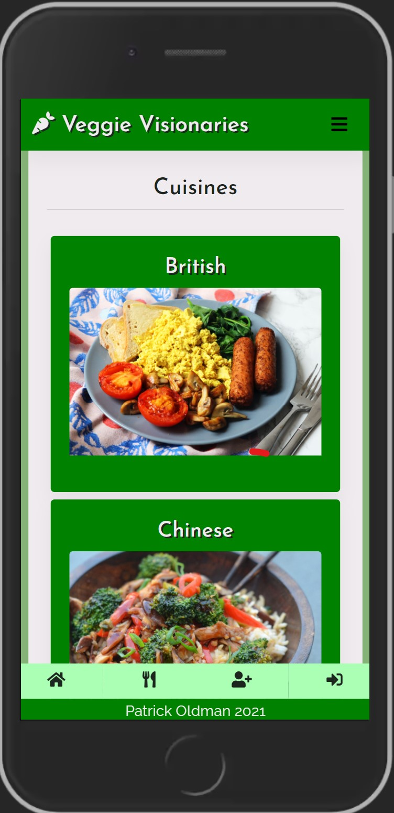

    - Tablet
    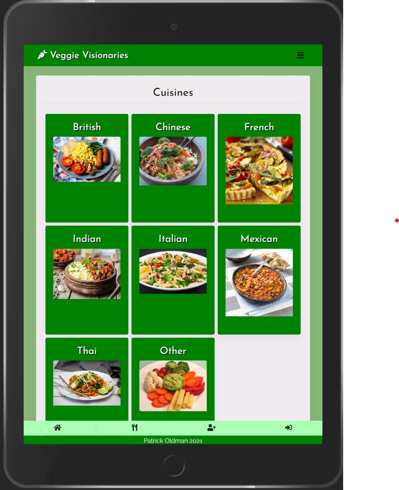

    - Laptop
    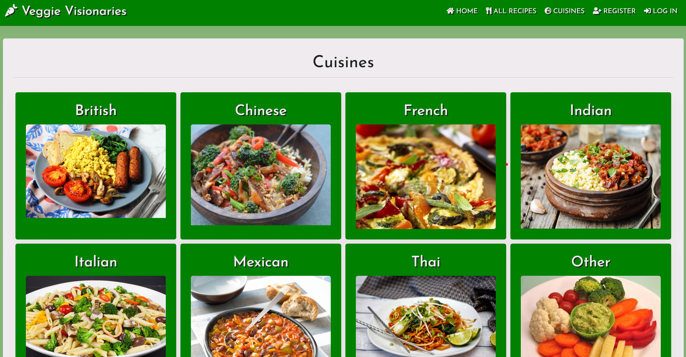

I am a returning visitor/member and I want:

1. To be able to save my favourite recipes to my account
  - Recipes can be saved from the recipe page
  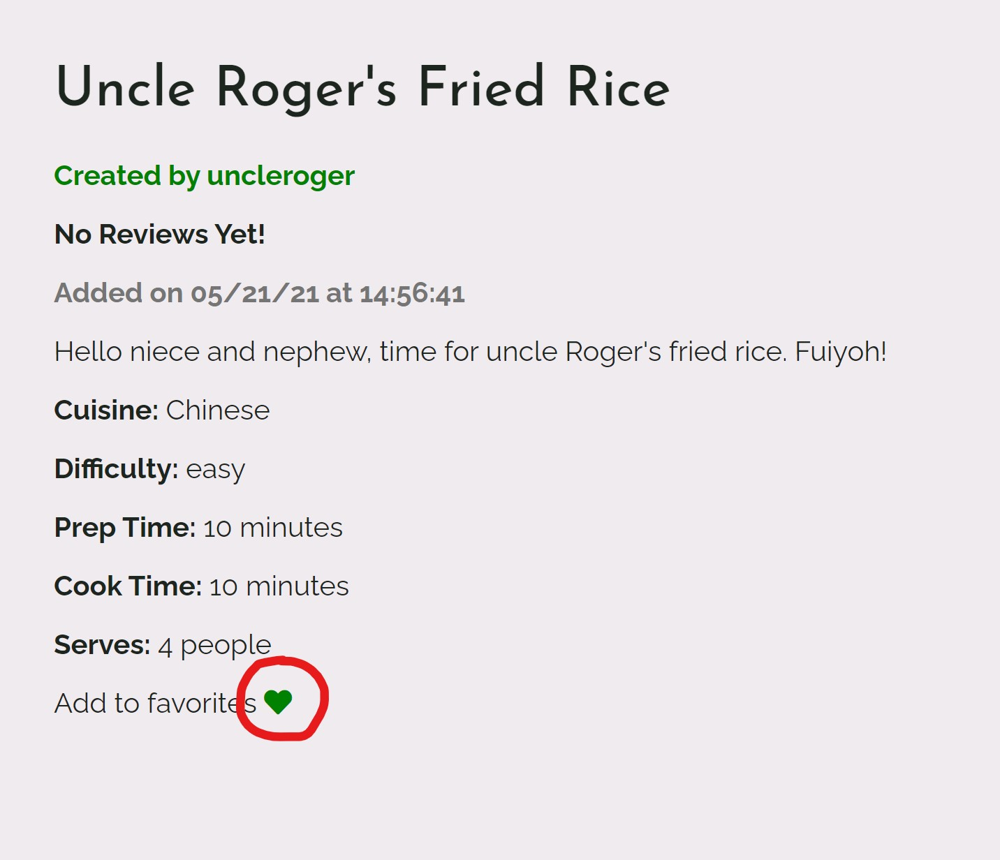

2. To be able to easily accessed saved recipes
  - Favourited recipes can be accessed at any time by the logged-in user directly from the navbar
  

3. To be able to easily add my recipes
  - The add recipe page is easily accessible from the navbar and the splash screen for a logged-in user.
  - The page itself is easy to follow and contains all relevant information so the user does not enter invalid data, for example specifying units of time, specifying how many ingredients are allowed, or how many characters can be entered into the description text box.
  

4. To be able to edit and delete my recipes
  - A user can access the edit/delete buttons for their added recipes from either the recipe page itself or from the recipe list page.

    - A logged-in user looking at a recipe they have created on the recipe list
    

    - A logged-in user looking at a recipe they have created on the recipe page
    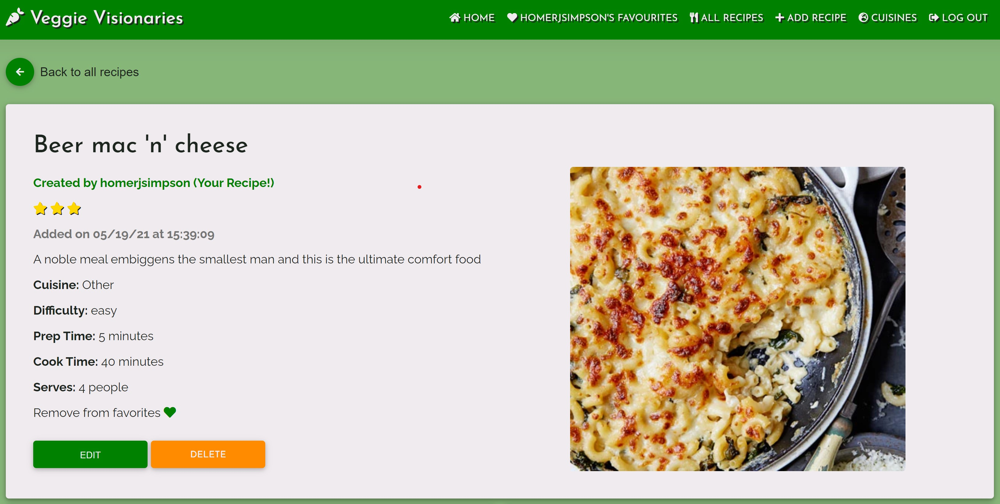

5. To be able to see which recipes are highly rated/well-reviewed
  - Any user can see the top-rated recipes from both the home page and from the recipes page.
    - The home page features the top 5 most highly rated recipes
    
    - The recipes can be sorted by top-rated first on the recipes page
    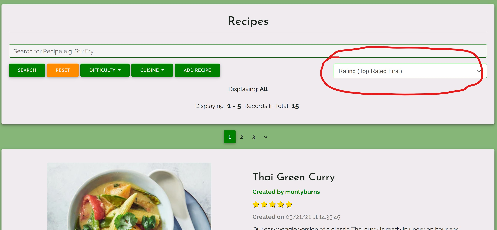

6. To be able to review recipes
  - A logged-in user can review a recipe from the recipes page as well as view all reviews that have been previously made
    - Review form
    
    - Reviews
    

I am the website owner and I want:

1. To encourage first-time visitors to return to the site
  - Beauty is in the eye of the beholder, but general feedback from people who have helped me test this app has been overwhelmingly positive in terms of visual design and UX. The app is pleasing to the eye and easy to use. Bright bold colours and clear information lend a very pleasant user experience. 

2. To encourage visitors to consider a vegetarian diet
  - Information has been included on the homepage which is intended to encourage visitors to eat less meat in the '7 Reasons to go Veggie' card
  

3. To have full administrative control over the site so I can delete/edit recipes as necessary easily
  - The admin account has full authority to delete/edit all recipes on the website - see image below recipe is created by user 'uncleroger', admin is logged in and the edit/delete buttons are visible
  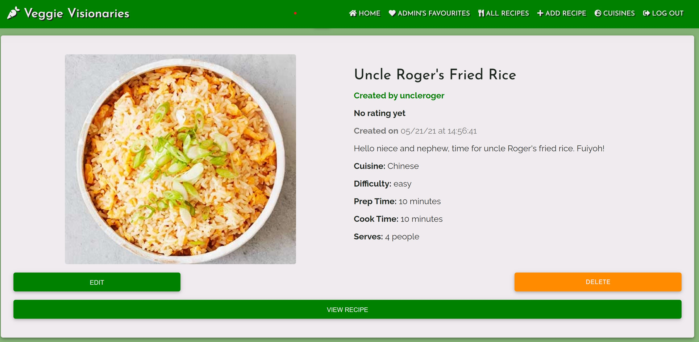
  - Admin can also delete reviews - see image below review is created by user 'elvis', admin is logged in and the delete button is visible
  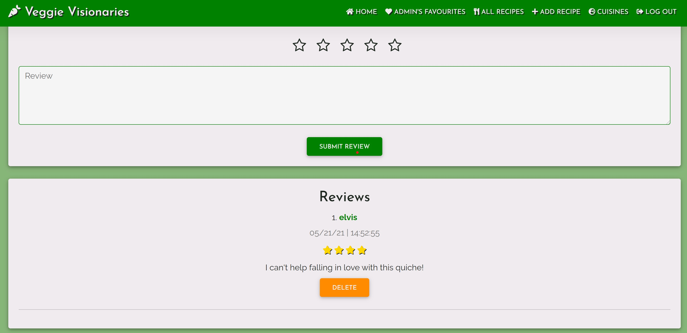
  - Admin can add/edit/delete cuisines.
  

### Device and Browser Testing

* Chrome developer tools used throughout development to check usability on different devices/sizes. Devices "used" on dev tools include:
  - Moto G4 and iPhone 6/7/8, as these are fairly standard sizes for mobile devices
  - iPhone 5/SE and Samsung Galaxy Fold, as these are relatively narrow mobile devices
  - Pixel 2 XL and iPhone X, as these are larger mobile devices
  - Ipad and Surface Pro, as these are standard sizes for tablet devices
  - Ipad Pro, as this is a higher resolution tablet device

* Personal devices used to check usability after deployment
  - OnePlus Nord mobile phone
  - Huawei Mediapad M5 10" tablet
  - Dell Inspiron 7577 laptop
  - Dell U2520D monitor

* Friends and family asked to check usability on their Apple mobile, laptop, desktop, and tablet devices, particularly to check usability on Safari browser

* Browsers checked were Chrome, Firefox, Edge, Opera, and Safari on all device types

#### Bugs

The only bug I was able to find while testing was that the images did not always display correctly on the Safari browser. This was only an issue on one device, on all other Apple devices tested, this issue did not persist so it could simply be an issue with permissions/settings that user had on their browser.

### Code Validation

* HTML code validator found no major errors on any pages

* CSS code validator found no errors in my CSS file

* JS Hint found no errors in my JavaScript file

* There are a few warnings on my app.py python file regarding unbalanced tuple unpacking and unused variables in my pagination functions. However, these are necessary for the functions to work and can be disregarded

### Chrome Dev Tools Lighthouse

Chrome dev tools lighthouse was used to test the site for performance, accessibility, best practices and SEO. Tests were run in incognito mode on Chrome to prevent stored data from affecting loading performances.

Performance was good on all pages for both mobile and desktop, generally scoring in the 90s on each test.

Accessibility also scored well, scoring 95+ on all pages. Points were deducted for the insufficient contrast ratio between background and foreground colours on the navbar and button elements. After user testing this, no users found the colour contrast problematic so I made no changes to this.

The best practices score also scored in the 90s, generally only losing points for the inclusion of the jQuery CDN which according to the report has 'known security vulnerabilities.

The SEO score tended to be around 90. This was due to the exclusion of a 'robots.txt' file, which provides instructions to search engine bots and helps web crawling. Another issue was the templated pagination links on the recipes page, which were uncrawlable due to having no href attribute. As these are added using a Jinja template rather than being hardcoded, I was unable to add this within the source code.

## Technologies Used

### Languages Used

* HTML5
* CSS3
* JavaScript
* Python 3

### Frameworks, Libraries and Programs Used

* [MDB - Material Design for Bootstrap](https://mdbootstrap.com/) - Used for responsive layout, flexbox, and several components on the site e.g. responsive navbar, cards and accordion.
* [jQuery](https://jquery.com/) - Used for interactive elements on the DOM and to simplify JavaScript use
* [Fontawesome](https://fontawesome.com/) - This was used for all icons on the page
* [Google Fonts](https://fonts.google.com/) - I used the fonts Josefin Sans and Raleway
* [Git](https://git-scm.com/) - Used for version control
* [Gitpod](https://gitpod.io/) - Text editor used to write all code
* [Github](https://github.com/) - GitHub is used to store the project's code after being pushed from Git
* [Heroku](https://id.heroku.com/) - Used to deploy website
* [Figma](https://www.figma.com/) - used to create the wireframe
* [Colourmind](http://colormind.io/bootstrap/) used to create the colour scheme. A very useful tool as it shows you what the colour palette looks like on a mock website
* [Coolors](https://coolors.co) used to show pallette
* [Compressjpeg](https://compressjpeg.com/) - used to compress hero image
* [favicon.io](https://favicon.io/) - used to create favicon image
* [W3C Validator](https://validator.w3.org/) - used to validate HTML file
* [W3C Validator](https://jigsaw.w3.org/css-validator/) - used to validate CSS file
* [JS Hint](https://jshint.com/) - used to check JavaScript file

## Deployment

### Cloning the repository

1. Log in to GitHub and locate the [GitHub Repository](https://github.com/)
2. Under the repository name, click "Clone or download".
3. To clone the repository using HTTPS, under "Clone with HTTPS", copy the link.
4. Open Git Bash
5. Change the current working directory to the location where you want the cloned directory to be made.
6. Type `git clone`, and then paste the URL you copied in Step 3.

### Working with the local copy

1. Create environment variables by signing up to a MongoDB account and then creating a cluster and a database. Create 4 collections within the database for 'Users', 'Recipes', 'Reviews' and 'Cuisines'.
2. Create an env.py file in the root directory and enter the following content to link the project to the database and to ensure you can view the project using a local port. Use the environment variables from your MongoDB database:

  ```
  import os

  os.environ.setdefault("IP", "0.0.0.0")
  os.environ.setdefault("PORT", "5000")
  os.environ.setdefault("SECRET_KEY", "secret_key")
  os.environ.setdefault("MONGO_URI", "mongo_uri")
  os.environ.setdefault("MONGO_DBNAME", "mongo_dbname")
  ````

3. Add the env.py file to .gitignore to ensure that this information is not pushed to the repo
4. Install all required modules by entering the command 'pip3 install -r requirements.txt' to the terminal
5. To run the app locally type 'python3 app.py 'to the command terminal

### Deploying to Heroku

1. Create a GitHub repository for the app
2. Initialize git for the app by using the 'git init' command in the terminal
3. To link the app to your repository use the following command in the terminal 'git remote add origin <https://github.com/>USERNAME/REPONAME.gitgit push -u origin master'. From now on any further pushes will be automatically pushed to this location
4. Create file 'Procfile' within the root directory and enter the content 'web: python app.py'
5. Ensure requirements are up to date by entering the command 'pip3 freeze > requirements.txt' to the terminal
6. Push both files to the repository
7. Create/Sign in to a Heroku account and create a new app, select your local region.
8. Within the Heroku app settings, add config vars. These must have the same values as what is included in the env.py file.
9. Under the Heroku app 'deployment' section, select GitHub as the deployment method. Choose the repo under your account
10. Find your GitHub account and enter the repo name to connect to your GitHub repo
11. To set automatic deployment, select a repo branch in the deployment section and enable automatic deployment
12. To manually deploy the app, scroll to the bottom of the deployment section and select 'Deploy Branch'
13. The app should now be deployed, enjoy!

## Credits

### Code

#### CSS

* Star rating system copied and adapted from [Code Convey](https://codeconvey.com/html-star-rating-system/)

#### JavaScript

* Dynamic input function taken and adapted from [Codex World](https://www.codexworld.com/add-remove-input-fields-dynamically-using-jquery/)
* Sort function copied and adapted from [Code Institute Tutorial](https://learn.codeinstitute.net/courses/course-v1:CodeInstitute+FSF_102+Q1_2020/courseware/4201818c00aa4ba3a0dae243725f6e32/252883608f734d96ac352ca483451968/?child=first)

#### Python

* Pagination function copied and adapted from [Github user Mozilla ZG](https://gist.github.com/mozillazg/69fb40067ae6d80386e10e105e6803c9)

### Images

* [unsplash](https://unsplash.com/photos/4_jhDO54BYg) for hero image of vegetables. Photographer credit: Dan Gold
* All recipe images and cuisine images were taken from the [BBC Good Food Website](https://www.bbcgoodfood.com/)

### Text

* [ohmyveggies.com](https://ohmyveggies.com/reasons-to-become-vegetarian/) for the '7 reasons to become vegetarian' text
* All recipe text was taken from the [BBC Good Food Website](https://www.bbcgoodfood.com/)

### Acknowledgements

* Thanks to my mentor Arnold Kyeza for his generosity in providing me with his time, tips and feedback on the site
* Thanks to the Code Institute Slack community for providing resources and tips as well as peer-reviewing the project
* Thanks to Code Institute Tutor Igor for his patience in helping me find a way to sort the recipes and providing me with the link above for the sort function
* Thanks to friends and family for taking the time to look at the site and give advice on both content and user stories, in particular, thanks to Robert Smith for his UX and content ideas and feedback
* [W3 Schools](https://www.w3schools.com/) and [Stackoverflow](https://stackoverflow.com/) were useful as always to double-check things and get the correct syntax for functions.
* [MongoDB Manual](https://docs.mongodb.com/manual/) was useful for developing the database
* Chrome Dev Tools
  - Testing and adjusting CSS styles
  - Testing my JavaScript using the console
  - Testing local storage in the Application section
  - Testing using the Lighthouse
